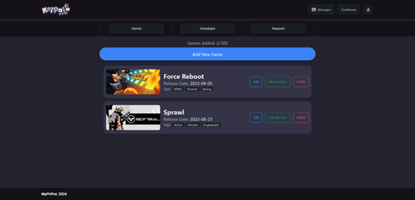
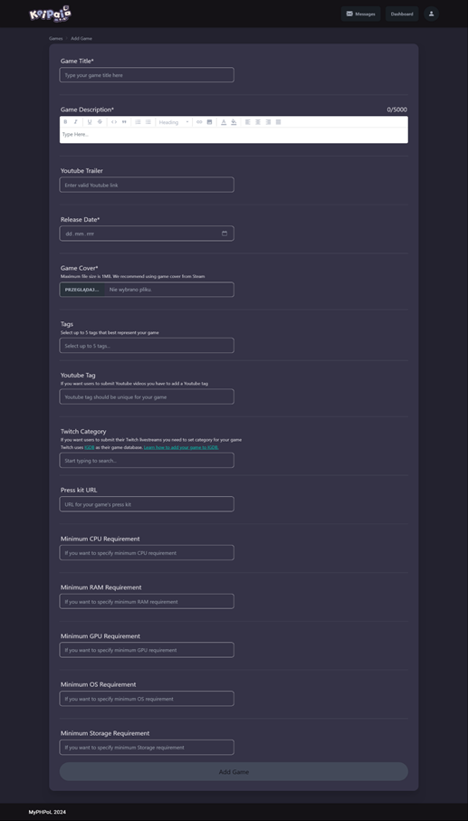

# KeiPai
## About

**KeiPai is a web application as a social networking site for game developers and influencers.**


The idea behind this app was to mimic platforms such as [Keymailer](https://keymailer.co), [Lurkit](https://lurkit.com) and [Woovit](https://woovit.com).

This repository contains both server and client related files, which should let you host your own instance of this application.

## Features

### As a developer:
* Add games to your library
* Manage keys to each game
* Start promotial campaigns for your games
    * Select between manual and automatic key distribution system
    * Set start-date and end-date
    * Set minimum requeirements for each social media platform
    * Add a description with markdown support
    * Set key limit for each game platform
* Accept or decline incoming requests
* Monitor your campaign statistics
* Visit influencer profiles and check their YouTube videos and Twitch streams
* Review influencers you worked with
* Send private messages between other developers and influencers

### As an influencer:
* Connect your YouTube and Twitch accounts
* Browse available campaigns and filter them by:
    * Tags
    * Platforms
* Send requests to join campaigns
* System automatically detects if you uploaded video or livestream onto selected platform
* Visit developer profiles and check uploaded games and running campaigns
* Send private messages between other influencers and developers

### System features:
* User verification with OAuth 2.0
* Accurate content data with the official YouTube and Twitch APIs
* JWT stored safely in cookies
* File storage with Azure Blob Storage
* Real-time communication with Twitch servers via webhooks

## Tech Stack
Server: .NET 8.0, Entity Framework Core  
Database: MS SQL, Azure Blob Storage  
Client: Angular 18, Tailwind CSS, daisyUI

## Prerequisites

### Part 1: Aquiring credentials
For the app to work properly you need to generate both [YouTube](https://youtube.com) and [Twitch](https://twitch.tv) OAuth Client Credentials. You also need [Azure Blob Storage](https://azure.microsoft.com/products/storage/blobs) connection string to store images. If you also want to test out Twitch functionality locally you need to create a [ngrok](https://ngrok.com) account and generate a static domain.

**Twitch OAuth Client Credentials**
1. Create an account and login on [Twitch Developers](https://dev.twitch.tv)
2. Click on `Your Console` button in the upper right corner
3. Click on the `Register Your Application` button
4. Fill out form with following informations:
    * Name -- can be anything e.g. KeiPai
    * OAuth redirect URI -- http://localhost:4200/twitch-success
    * Category -- Website Integration
    * Client Type -- confidential
5. Submit form and click on the generated application
6. Copy generated Client ID and Client Secret

**YouTube OAuth Client Credentials**
1. Create an account and login on [Google Cloud](https://cloud.google.com)
2. Click on `Console` button in the upper right corner
3. Create a new Project, you can name it anyway you want
4. After project gets created select it
5. From navigation menu choose `APIs & Services`
6. Navigate to `Library` and search for `YouTube Data API v3`, then select and enable it
7. Go back and and select `OAuth consent screen`
8. Click on the `Get Started` button
9. Fill out the form with following informations:
    * App name -- can be anything e.g. KeiPai
    * User support email -- select your email
    * Audience -- External
    * Contact Information -- enter your own email address
10. Submit form
11. Select `Audience` tab and add your email as a test user
12. Select `Data Access` tab and click on the `Add Or Remove Scopes`
13. From list select scopes: `.../auth/userinfo.email` and `../auth/youtube.readonly`
14. Update changes
15. Select `Clients` tab and click on the `Create Client` button
16. Fill out the form with these informations:
    * Application type -- Web application
    * Name -- can be anything e.g. KeiPai
    * Authorized JavaScript origins -- http://localhost:4200
    * Authorized redirect URIs -- http://localhost:4200/youtube-success
17. Submit form and click on the download icon on the generated client
18. Copy generated Client ID and Client Secret

**Azure Blob Storage Connection String**
1. Create an account and login on [Microsoft Azure](https://azure.microsoft.com)
2. Click on `Create a resource` button
3. Select from categories `Storage` and click on `Create` under `Storage account`
4. Fill out the form with following informations:
    * Subscription -- choose any available
    * Resource group -- can be anything e.g. KeiPai
    * Storage account name -- can be anything e.g. keipaistorage
    * Region -- best to choose recommended one
    * Primary service -- Azure Blob Storage or Azure Data Lake Storage Gen 2
    * Performance -- Standard
    * Redundancy -- Locally-redundant storage (LRS)
5. Leave all the remaining fields as they are and complete the setup
6. After finishing deployment click on `Go to resource` button
7. Under the properties section click on `Blob service` text
8. Click on the `Container` button and name the new container `images`
9. Go back to Resource and from the list on the left side of the screen select `Security + networking` and `Access keys`
10. Copy one of the available Connection Strings

**ngrok static domain**  
*This step is only required if you are going to test out locally Twitch integration*
1. Create an account and login on https://ngrok.com
2. In the dashboard choose option `Domains` under the `Universal Gateway` section
3. Click on the `New Domain` button
4. Copy created domain

### Part 2: Installing necessary software

**1. Install .NET 8 SDK**
* Download and install the .NET 8 SDK from the official [.NET download page](https://dotnet.microsoft.com/download/dotnet/8.0)

**2. (Optionally) Install Visual Studio 2022**
* Download and install Visual Studio 2022 from the official [Visual Studio download page](https://visualstudio.microsoft.com/downloads/)
* During installation ensure you select the following workloads:
    * ASP.NET and web development
    * .NET desktop development

**3. Install SQL Server**
* Download and install SQL Server from the official [SQL Server download page](https://www.microsoft.com/sql-server/sql-server-downloads)

**4. Install SQL Server Management Studio (SSMS) for easier database management**
* Download and install SSMS from the official [SQL Server Management Studio download page](https://learn.microsoft.com/ssms/download-sql-server-management-studio-ssms?view=sql-server-ver16)

**5. Install Node.js**
* Download and install Node.js from the official [Node.js download page](https://nodejs.org/en/download)

**6. (Optionally) Install ngrok**
* Download, install and configure ngrok from the official [ngrok download page](https://ngrok.com/downloads/windows)

## Installation

**1. Download or clone this repository**
```bash
git clone https://github.com/ptkr0/KeiPai.git
```

**2. Navigate to server directory**
```bash
cd <KeiPai/server>
```

**3. Install all the NuGet Packages**
* Restore the NuGet packages by running:
```bash
dotnet restore
```

* (Alternatively) Open solution file (`.sln`) in Visual Studio 2022
* Restore the NuGet packages by right-clicking on the solution in the Solution Explorer and selecting "Restore NuGet Packages"

**4. Set up the database**
* Open SSMS and connect to your SQL Server instance
* In Object Explorer, right-click on `Databases` and select `New Database` option
* Enter your database name e.g. keipai
* Click `OK`
* Right-click on created database and select `Properties` option
* Copy `Name` and `Owner` (copy only machine name e.g. DESKTOP-38EFFIN) values

**5. Set up the appsettings.json**
* Inside KeiPai/server directory create a new file called `appsettings.json`
* Using `appsettings - example.json` file as an example and fill with necessary data created in previous steps

**6. Apply the migration**
* Apply migrations and create the database by running:
```bash
dotnet ef database update
```
* If operation fails, try installing `dotnet ef` tool by running:
```bash
dotnet tool install --global dotnet-ef --version 8.0.0
```

**7. Navigate to client directory**
```bash
cd <KeiPai/client>
```

**8. Install the required npm packages**
* Install all the necessary packages by running:
```bash
npm install
```

**9. Configure client environment file**
* Navigate to the environments directory
```bash
cd <KeiPai/src/client/environments>
```
* Create a new file called `environment.development.ts`
* Using `environment.development - example` file as an example and fill with necessary data created in previous steps

## Usage

1. Start the server by running the following command with terminal inside the server directory:
```bash
dotnet run
```
* Server should start running on `https://localhost:7157` -- if it runs on different port be sure to update `environment.development.ts` accordingly
* (Alternatively) Open solution file (`.sln`) from the server directory in Visual Studio 2022
* Press F5 to start the project

2. Start the client by running the following command with terminal inside the client directory:
```bash
npm start
```
* Client should start running on `localhost:4200` -- if it runs on different port be sure to update `appsettings.json` accordingly

3. (Optionally) Start ngrok by running:
```bash
ngrok http --url=<generated-domain> <https://localhost:7157>
```

## Screenshots

| |
|:--:| 
| *Welcome page* |

| |
|:--:| 
| *Login* |

| |
|:--:| 
| *Register dialog option* |

| |
|:--:| 
| *Register as developer* |

| |
|:--:| 
| *Register as influencer* |

| |
|:--:| 
| *Game list* |

| |
|:--:| 
| *Add game* |


| |
|:--:| 
| *Game page* |

| |
|:--:| 
| *Game keys page* |

| |
|:--:| 
| *Add keys* |

| |
|:--:| 
| *Campaign list* |

| |
|:--:| 
| *Add campaign* |

| |
|:--:| 
| *Campaign page* |

| |
|:--:| 
| *Pending requests list* |

| |
|:--:| 
| *Campaign statistics* |

| |
|:--:| 
| *Review dialog* |

| |
|:--:| 
| *Available campaigns* |

| |
|:--:| 
| *Settings page* |

| |
|:--:| 
| *Settings page* |

| |
|:--:| 
| *Send request dialog* |

| |
|:--:| 
| *Pending requests* |

| |
|:--:| 
| *Accepted requests* |

| |
|:--:| 
| *Completed requests* |

| |
|:--:| 
| *Developer profile* |

| |
|:--:| 
| *Influencer profile* |

| |
|:--:| 
| *Private messages* |

## Made by

Piotr Radziszewski  

*MyPHPoL™ 2024-2025*